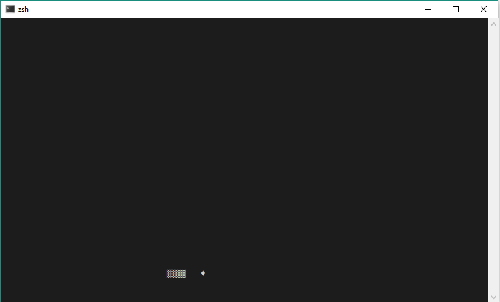
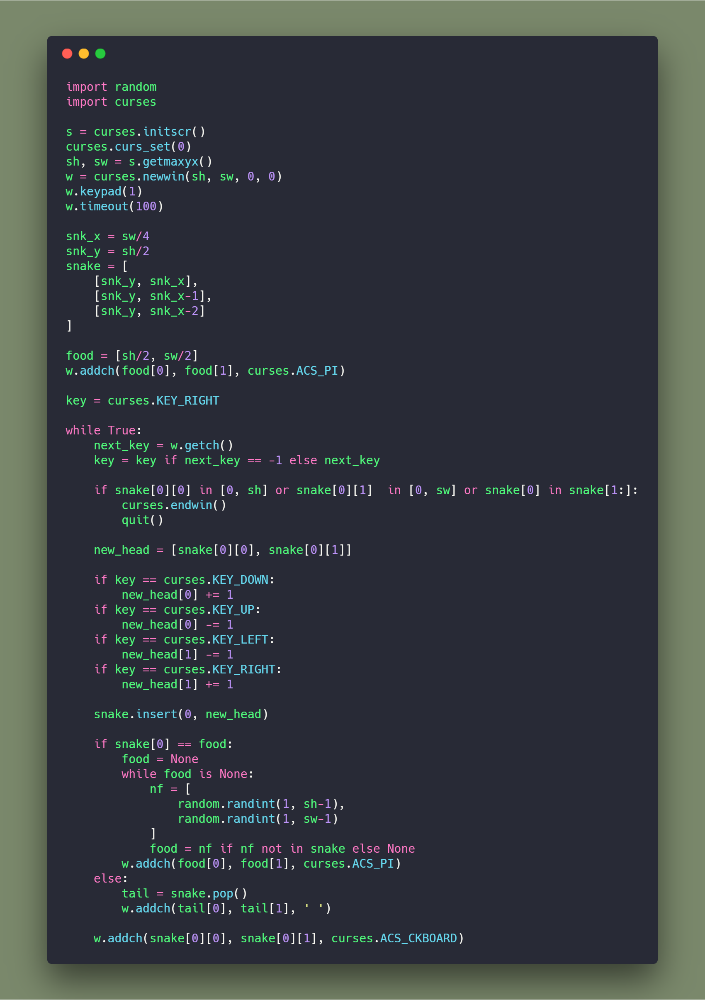
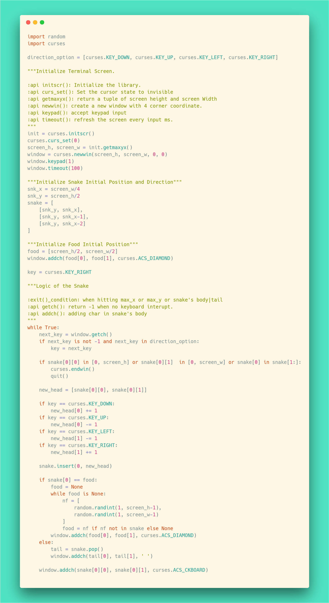

<h3 style="text-align:center;font-weight: 300;" align="center">
  
</h3>

  
  
  

> A Refactoring Attempt of Engineerman's Snake Game

## Demo

## Dev Goals

🔥 Attempting Refactoring in Python

⚡ Consolidating **Python Class**. `Failed` Due to no reasons of doing that....

<!-- 🍇 🍈 🍉 🍊 🍋 🍌 🍍 🍎 🍏 🍐 🍑 🍒 🍓 🥝 🍅 🥥 -->
## Origin
| Author          |   Video |
| ------------- |:-------------:|
| Engineerman     | [🍉](https://www.youtube.com/watch?v=rbasThWVb-c&t=9s)|

##### Orignal Source Code

## Refactor
##### Refactored Source Code

## License

🌱 MIT 🌱

---
>  [yuzhoujr.com](http://www.yuzhoujr.com) &nbsp;&middot;&nbsp;
>   [@yuzhoujr](https://github.com/yuzhoujr) &nbsp;&middot;&nbsp;
>   [@yuzhoujr](https://linkedin.com/in/yuzhoujr)
